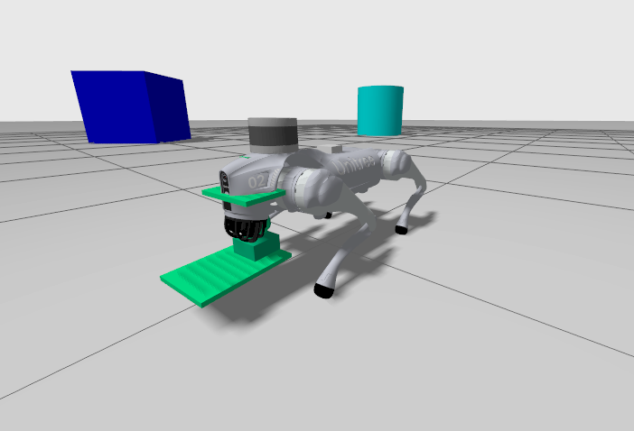

# Unitree GO2 with Fork Mechanism - Gazebo Simulation

## Description

Simplified 3-RRS parallel mechanism + Unitree GO2 Gazebo Simulation

This package provides a complete simulation environment for the Unitree GO2 quadruped robot equipped with a 3-DOF fork mechanism (simplified 3-RRS parallel mechanism). The simulation runs in Gazebo and includes keyboard teleoperation for both robot locomotion and fork manipulation.



## Build Instructions

```bash
colcon build --packages-select unitree_go2_description unitree_go2_sim --symlink-install
```

## Usage

### Terminal 1: Launch Gazebo Simulation

Open the simulation environment with the GO2 robot and fork mechanism:

```bash
cd /mnt/data/2026_1/go2_ws
source install/setup.bash
ros2 launch unitree_go2_sim unitree_go2_with_fork_launch.py
```

### Terminal 2: Launch ROS Bridge

Start the ROS-Gazebo bridge for communication:

```bash
cd /mnt/data/2026_1/go2_ws
source install/setup.bash
ros2 launch unitree_go2_sim unitree_go2_with_fork_launch.py
```

### Terminal 3: Execute Teleop

Run the keyboard teleoperation node:

```bash
cd /mnt/data/2026_1/go2_ws
source install/setup.bash
ros2 run unitree_go2_sim go2_fork_teleop.py
```

## Key Mapping

The teleoperation node provides keyboard control for both the GO2 robot base and the fork mechanism.

### Robot Base Control

| Function                | Key           | Description                           |
| ----------------------- | ------------- | ------------------------------------- |
| Forward / Backward      | `w` / `x`     | Move robot forward or backward        |
| Strafe Left / Right     | `q` / `e`     | Move robot left or right              |
| Rotate Left / Right     | `a` / `d`     | Rotate robot counterclockwise or clockwise |
| Stop Robot              | `space` or `m` | Stop all robot velocity               |

### Fork Mechanism Control

| Function                | Key       | Description                           |
| ----------------------- | --------- | ------------------------------------- |
| Fork Up / Down          | `8` / `2` | Lift fork up or down (Z-axis)         |
| Fork Roll + / -         | `4` / `6` | Roll fork left or right               |
| Fork Pitch + / -        | `7` / `9` | Pitch fork forward or backward        |
| Fork Hold Current Pose  | `5`       | Maintain current fork position        |
| Fork Reset to Zero      | `0`       | Reset all fork joints to zero         |

### Speed and Step Adjustment

| Function                      | Key       | Description                           |
| ----------------------------- | --------- | ------------------------------------- |
| Increase / Decrease Linear Speed  | `u` / `j` | Adjust forward/backward speed         |
| Increase / Decrease Angular Speed | `i` / `k` | Adjust rotation speed                 |
| Increase / Decrease Fork Step     | `o` / `l` | Adjust fork joint step size           |

### Utility Commands

| Function            | Key       | Description                           |
| ------------------- | --------- | ------------------------------------- |
| Print Current State | `p`       | Display current velocities and positions |
| Print Help          | `h`       | Show help message                     |
| Exit                | `Ctrl-C`  | Quit teleoperation node               |

## Code Reference

To modify the key mappings, all keyboard input handling is implemented in the `handle_key()` method of the `Go2ForkTeleop` class in `go2_fork_teleop.py`.

## Topics Published

- `/cmd_vel` (geometry_msgs/Twist): GO2 velocity commands
- `/object_lifter/z_lift_joint/cmd_pos` (std_msgs/Float64): Fork Z-axis position
- `/object_lifter/roll_joint/cmd_pos` (std_msgs/Float64): Fork roll position
- `/object_lifter/pitch_joint/cmd_pos` (std_msgs/Float64): Fork pitch position

