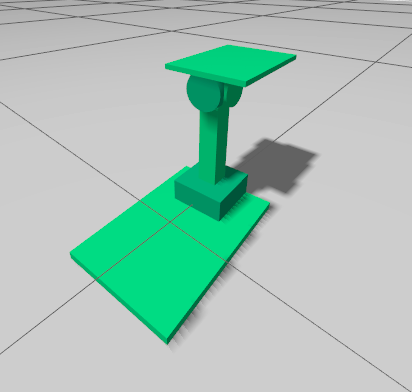

# Quadruped 3-RRS Simulation

Simplified 3-RRS parallel mechanism URDF model for quadruped forklift simulation.

## Description

This package contains a simplified 3-RRS (Revolute-Revolute-Spherical) parallel mechanism designed as a forklift attachment for quadruped robots. The URDF model includes the base plate, lifting mechanism, and top platform.

---

## Build & Run

### 1. Build the package

Navigate to your workspace and build the package:

```bash
colcon build --packages-select object_lifter_description
source install/setup.bash
```

### 2. Launch in Gazebo

To load the simulation environment:

```bash
ros2 launch object_lifter_description gazebo_ros_ign.launch.py
```

### 3. Control the Mechanism (Teleop)

To manually control the mechanism, open a new terminal and run the following commands:

```bash
source install/setup.bash
ros2 launch object_lifter_description teleop.launch.py
```

---
